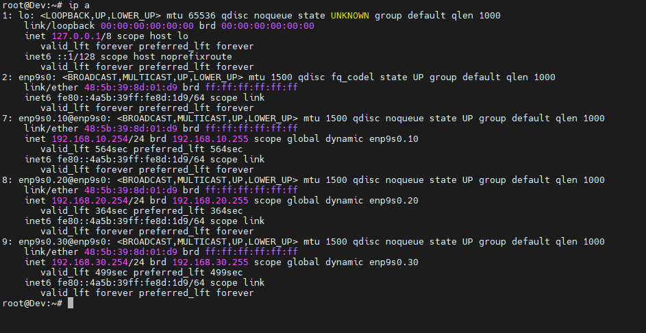

# README: Налаштування VLAN на MikroTik та Debian 12

Покрокове налаштування VLAN на маршрутизаторі MikroTik та сервері з Debian 12.

---

## Налаштування VLAN на MikroTik

1. **Логін у MikroTik**
   Winbox, SSH або веб-інтерфейс, щоб підключитися до маршрутизатора.

2. **Додавання VLAN інтерфейси**
   Команда для кожного VLAN:
   ```bash
   /interface vlan add name=vlan10 vlan-id=10 interface=ether3
   /interface vlan add name=vlan20 vlan-id=20 interface=ether3
   /interface vlan add name=vlan30 vlan-id=30 interface=ether3
   ```

3. **Додавання IP-адреси до VLAN інтерфейсів**
   ```bash
   /ip address add address=192.168.10.1/24 interface=vlan10
   /ip address add address=192.168.20.1/24 interface=vlan20
   /ip address add address=192.168.30.1/24 interface=vlan30
   ```

4. **Налаштування DHCP-сервер для кожного VLAN**
   Для кожного VLAN додати пул адрес і налаштувати DHCP-сервер:
   ```bash
   /ip pool add name=pool_vlan10 ranges=192.168.10.100-192.168.10.200
   /ip pool add name=pool_vlan20 ranges=192.168.20.100-192.168.20.200
   /ip pool add name=pool_vlan30 ranges=192.168.30.100-192.168.30.200

   /ip dhcp-server add name=dhcp_vlan10 interface=vlan10 address-pool=pool_vlan10 lease-time=10m
   /ip dhcp-server add name=dhcp_vlan20 interface=vlan20 address-pool=pool_vlan20 lease-time=10m
   /ip dhcp-server add name=dhcp_vlan30 interface=vlan30 address-pool=pool_vlan30 lease-time=10m

   /ip dhcp-server network add address=192.168.10.0/24 gateway=192.168.10.1 dns-server=8.8.8.8,8.8.4.4
   /ip dhcp-server network add address=192.168.20.0/24 gateway=192.168.20.1 dns-server=8.8.8.8,8.8.4.4
   /ip dhcp-server network add address=192.168.30.0/24 gateway=192.168.30.1 dns-server=8.8.8.8,8.8.4.4
   ```

5**Перевірка конфігурації**
   Команда:
   ```bash
   /interface print
   /ip address print
   /ip dhcp-server print
   ```

---

## Налаштування VLAN на Debian 12

1. **Встановити необхідні пакети**
   У Debian підтримка VLAN включена за замовчуванням. Переконатись, що модуль `8021q` завантажений:
   ```bash
   sudo apt update
   sudo apt install vlan
   sudo modprobe 8021q
   ```

2. **Налаштування файлу `/etc/network/interfaces`**
   ```bash
   sudo nano /etc/network/interfaces
   ```

   Конфігурація:
   ```text
   # Фізичний інтерфейс для VLAN
   allow-hotplug enp9s0
   iface enp9s0 inet manual

   # VLAN 10
   auto enp9s0.10
   iface enp9s0.10 inet dhcp

   # VLAN 20
   auto enp9s0.20
   iface enp9s0.20 inet dhcp

   # VLAN 30
   auto enp9s0.30
   iface enp9s0.30 inet dhcp
   ```

3. **Перезапуск мережевих сервісів**
   ```bash
   sudo systemctl restart networking
   ```

4. **Перевірка інтерфейсів VLAN**
   ```bash
   ip a
   ```

5. **Тестування з'єднання**
   ```bash
   ping 192.168.10.1
   ping 192.168.20.1
   ping 192.168.30.1
   ```

---

## Діагностика

### На стороні MikroTik:
1. Перевірка, чи активні інтерфейси VLAN:
   ```bash
   /interface vlan print
   ```

2. Перевірка маршрути та фаєрвол:
   ```bash
   /ip route print
   /ip firewall filter print
   ```

### На стороні Debian:
1. Перевірка таблицю маршрутів:
   ```bash
   ip route
   ```

2. Перевірка `tcpdump` для аналізу трафіку:
   ```bash
   sudo tcpdump -i enp9s0.10
   ```
   
   
   
   

---